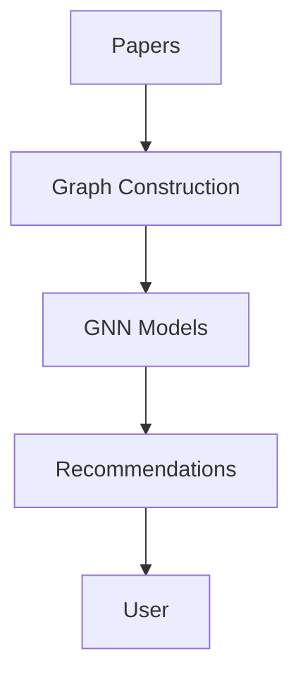

# 📊 Research Compass - GNN Presentation Materials

This folder contains presentation materials for explaining Research Compass from a **Graph Neural Networks (GNNs)** perspective.

## 📁 Files Included

1. **GNN_Presentation.md** - Master slide deck in Markdown format (25+ slides)
2. **generate_slides.py** - Python script to generate PowerPoint (.pptx)
3. **README.md** - This file (instructions)

---

## 🚀 Quick Start

### Option 1: View Markdown (Simplest)
Just open `GNN_Presentation.md` in any text editor or markdown viewer.

### Option 2: Generate PowerPoint (Professional)
```bash
# Install required package
pip install python-pptx

# Generate slides
python generate_slides.py

# Output: Research_Compass_GNN_Presentation.pptx
```

### Option 3: Convert to PDF (Pandoc)
```bash
# Install pandoc (if not installed)
# Ubuntu/Debian: sudo apt install pandoc texlive
# Mac: brew install pandoc
# Windows: Download from pandoc.org

# Convert markdown to PDF slides
pandoc GNN_Presentation.md -t beamer -o GNN_Presentation.pdf

# Or with custom theme
pandoc GNN_Presentation.md -t beamer -o GNN_Presentation.pdf \
  --pdf-engine=xelatex \
  -V theme:metropolis \
  -V colortheme:default
```

### Option 4: Create HTML Slides (reveal.js)
```bash
# Install pandoc

# Convert to reveal.js HTML
pandoc GNN_Presentation.md -t revealjs -s -o presentation.html \
  --slide-level=2 \
  -V theme=black \
  -V transition=slide

# Open presentation.html in browser
# Press 'S' for speaker notes, 'F' for fullscreen
```

### Option 5: Google Slides
1. Generate PowerPoint using Option 2
2. Upload `.pptx` to Google Drive
3. Open with Google Slides
4. Edit and present online

---

## 🎨 Customization

### Modify Markdown Slides
Edit `GNN_Presentation.md`:

```markdown
---
title: "Your Custom Title"
theme: "metropolis"  # beamer themes: metropolis, Madrid, Berlin, etc.
colortheme: "default"
---

# Your Slide Title
Content here...
```

### Customize PowerPoint Colors
Edit `generate_slides.py`:

```python
# Color scheme
PRIMARY_COLOR = RGBColor(0, 102, 204)      # Blue (your brand color)
SECONDARY_COLOR = RGBColor(51, 51, 51)     # Dark gray
ACCENT_COLOR = RGBColor(255, 152, 0)       # Orange
```

### Add Your Logo
In `generate_slides.py`, add to each slide:

```python
logo = slide.shapes.add_picture(
    'your_logo.png',
    Inches(14.5), Inches(0.2),  # Top-right corner
    height=Inches(0.5)
)
```

---

## 📋 Presentation Structure

### For Technical Audience (Researchers/ML Engineers)
**Focus on:** Slides 5-12 (Architecture, Models, Performance)
- Detailed GNN architectures
- Mathematical formulations
- Code snippets
- Training strategies
- Benchmarks

**Duration:** 30-40 minutes

### For Business/General Audience
**Focus on:** Slides 1-4, 10, 14 (Problems, Solutions, Benefits)
- Problem statement
- High-level solution
- Use cases
- ROI and benefits
- Live demo

**Duration:** 15-20 minutes

### For Academic Conference
**Include:** All slides + Q&A
- Full technical depth
- Experimental results
- Comparison with SOTA
- Limitations
- Future work
- Publications

**Duration:** 45-60 minutes

---

## 🎯 Presentation Tips

### Opening (5 min)
1. Start with the problem: "Research is a graph, not a list"
2. Show concrete example: Citation bias problem
3. Hook: "We use GNNs to solve this"

### Middle (25 min)
1. Explain each of 4 GNN models (5 min each)
   - What it does
   - How it works
   - Real-world use case
2. Show performance comparison (5 min)
   - 82% vs 60% accuracy
   - Concrete metrics

### Demo (10 min)
1. Upload sample papers
2. Ask question → show GNN processing
3. Get recommendations with explanations
4. Show temporal analysis
5. Interactive citation network

### Closing (5 min)
1. Recap key advantages
2. Show how to get started
3. Q&A

---

## 🖼️ Visual Aids

### Recommended Additions

1. **Graph Visualization**
   - Show sample citation network (5-10 nodes)
   - Highlight attention weights
   - Use tools: Pyvis, Graphviz, draw.io

2. **Architecture Diagram**
   - System components flowchart
   - GNN model architectures
   - Use: Mermaid, draw.io, Lucidchart

3. **Performance Charts**
   - Bar chart: GNN vs baselines
   - Line chart: Accuracy over time
   - Use: Plotly, Matplotlib, Excel

4. **Screenshots**
   - Gradio interface
   - Recommendation results
   - Attention heatmaps

### Create Diagrams with Mermaid

Add to markdown slides:

````markdown

````

---

## 🎥 Demo Preparation

### Before Presentation

1. **Setup Environment**
   ```bash
   cd "Research Compass"
   source .venv/bin/activate
   python launcher.py
   ```

2. **Prepare Sample Papers** (5-10 papers)
   - Mix of classic + recent
   - Related field (e.g., all NLP or all computer vision)
   - Pre-upload to save time

3. **Test Questions**
   - "What are the main innovations in transformers?"
   - "Find papers about attention mechanisms"
   - "Recommend papers similar to BERT"

4. **Backup Plan**
   - Pre-record demo video
   - Take screenshots
   - Have backup laptop

### During Demo

1. **Show Upload** (1 min)
   - Upload 3 papers live
   - Show progress bar

2. **Ask Question** (2 min)
   - Type question
   - Show GNN processing
   - Stream response word-by-word

3. **Show Recommendations** (2 min)
   - Enter interests
   - Get recommendations
   - Click "Explain" button → attention weights

4. **Citation Explorer** (2 min)
   - Enter paper title
   - Interactive graph appears
   - Click nodes to expand

5. **Temporal Analysis** (2 min)
   - Select topic
   - Show evolution chart
   - Point out emerging trends

---

## 📚 Additional Resources

### Papers to Reference
1. Kipf & Welling (2016) - GCN
2. Veličković et al. (2017) - GAT
3. Vaswani et al. (2017) - Transformers
4. Lewis et al. (2020) - RAG

### Related Projects
- PyTorch Geometric documentation
- Neo4j graph database
- FAISS vector search
- Sentence Transformers

### Backup Slides (if needed)
- Technical implementation details
- Training hyperparameters
- Ablation studies
- Error analysis
- Ethical considerations

---

## 🔧 Troubleshooting

### PowerPoint Generation Fails
```bash
# Error: "No module named 'pptx'"
pip install python-pptx pillow

# Permission error
chmod +x generate_slides.py
python3 generate_slides.py
```

### Pandoc Conversion Issues
```bash
# Error: "pandoc: command not found"
# Install pandoc first (see Option 3 above)

# PDF generation fails
# Install LaTeX: sudo apt install texlive-xetex

# Beamer theme not found
pandoc --list-highlight-styles  # See available themes
```

### Fonts Look Wrong
```bash
# Install recommended fonts
# Ubuntu/Debian:
sudo apt install fonts-liberation fonts-dejavu

# Mac:
# Fonts installed by default

# Windows:
# Use default system fonts (Calibri, Arial)
```

---

## ✅ Checklist Before Presentation

### 1 Week Before
- [ ] Review all slides
- [ ] Customize with your data
- [ ] Add your logo/branding
- [ ] Test demo environment
- [ ] Upload sample papers

### 1 Day Before
- [ ] Rehearse full presentation
- [ ] Time each section
- [ ] Test all equipment
- [ ] Export backup PDF
- [ ] Record demo video (backup)

### 1 Hour Before
- [ ] Start Research Compass
- [ ] Connect laptop to projector
- [ ] Test audio/video
- [ ] Open slides + demo in separate windows
- [ ] Put phone on silent

### During Presentation
- [ ] Speak slowly and clearly
- [ ] Make eye contact
- [ ] Pause for questions
- [ ] Show enthusiasm!
- [ ] Have water nearby

---

## 📞 Support

If you need help with the presentation:

1. **Technical Issues**: Check `/TECHNICAL_DOCUMENTATION.md`
2. **Demo Problems**: See `/DEMO_SCRIPT.py`
3. **Quick Start**: See `/QUICK_START_GUIDE.md`

---

## 📝 Feedback

After presenting, update these materials based on:
- Questions that were asked
- Slides that confused audience
- Time spent on each section
- Demo issues encountered

Good luck with your presentation! 🎉
